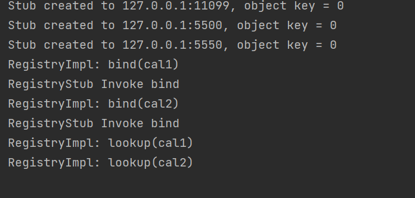
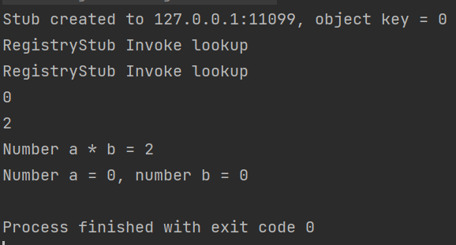

## Assignment2 RMI

Zou Ruotong 12012940

### Stub/Skeleton communication design

At first, server call method in class `UnicastRemoteObject` to create and start a skeleton for a remote object. Then it create a stub according to the information. In the process of running a skeleton,  the  `StubInvocationHandler` class get the parameters concerned from socket (remote skeleton) and send them to `SkeletonReqHandler`. The latter class deal with the request and send the results back to the former class, during which invoking the methods in `Registry` interface. At last, the client can get the remote object through `lookup` method in Registry. 

### Tests for my design

I implemented an interface `calculation` extending Remote, Serializable. Then two classes implementing the interface is created.  In server testing class, I create two instances of each class mentioned above and bind them to registry. In client testing class, I look up the two instances in registry and call methods of each instance. The result shows that the remote object is sent correctly to the client.

server:

client:

### Difficulties

The Object[] args parameter is not serializable and was not able to be transmitted by outputStream.writeObject method. To solve the problem, I create a Arguments class implement Serializable to seal the Object[] args. 